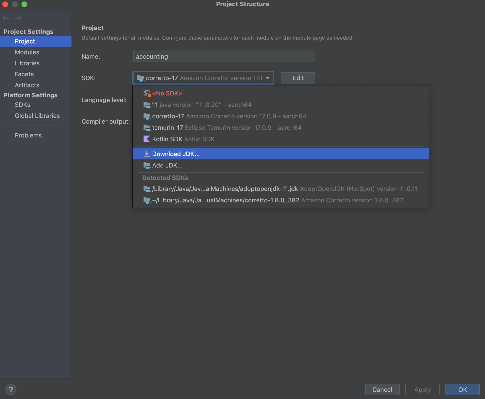
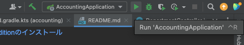
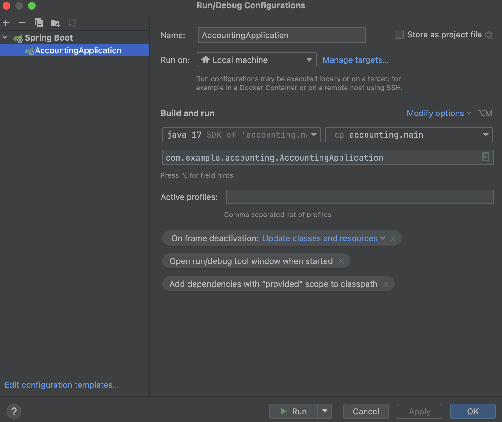
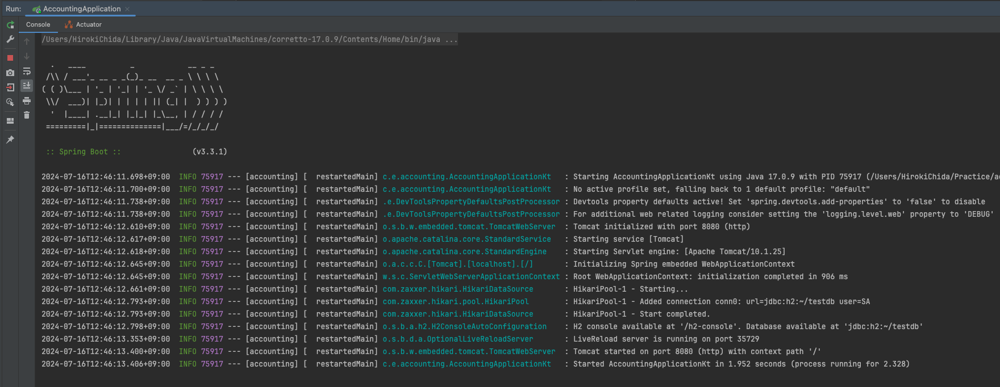
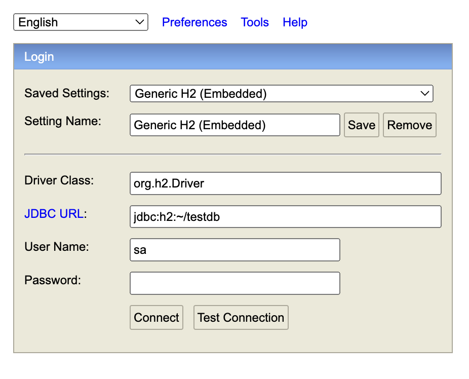

# サマーインターン用アプリケーション

## 環境構築
* ソースコードのダウンロード
* [IntelliJ Community Editionのインストール](https://www.jetbrains.com/ja-jp/idea/download/)

## 起動確認
* IntelliJでプロジェクトを開く

* メニューのFile > Project Structureを選択して、Java17をinstallする
<div style="text-align: center;"></div>

* 右上のRunボタンを押す
<div style="text-align: center;"></div>

* Runボタンが押せない場合はEdit Configurationsで以下のように設定する
<div style="text-align: center;"></div>

* 以下のように表示される
<div style="text-align: center;"></div>

* ブラウザで `http://localhost:8080/` にアクセスすると画面が表示される

## DB確認
* ブラウザで `http://localhost:8080/h2-console` にアクセスする
* 接続情報が以下になっていることを確認し、Connectを押す
<div style="text-align: center;"></div>

* DBをリセットする場合はホームディレクトリ直下にある `testdb.mv.db` などを削除する
* サーバーを起動すると自動的にマイグレーションが走る

## 動作確認
* GETリクエストは画面を用意しているが、POSTリクエストは画面は用意していないため、curlで確認・実装すること
```shell
$ curl -X POST -H "Content-Type: application/json" -d '{"code":"0001", "name":"TEST", "accountType": "PROFIT"}' http://localhost:8080/accounts
OK
```

## 注意事項
* ソースコードの公開はしないように協力お願いします
* 本来であればテストコードは書きますが、インターンの時間の都合上書いていません
